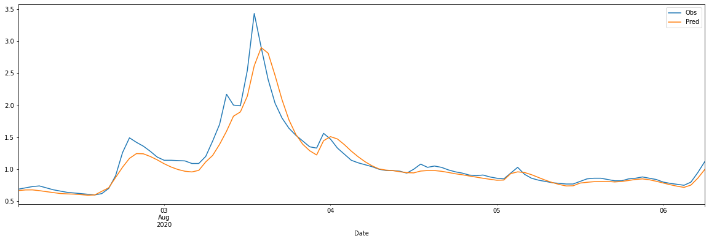

# [Tutorial] LSTM을 이용한 단시간 하천 수위 예측

## 1. 데이터 수집
  - WAMIS에서 제공중인 OpenAPI를 이용하여 수위 및 강우데이터를 수집하여 데이터셋 제공
    - 수집기간 : '14.1월 ~ '21.6월
    - 수집지역 : (수위) 남양주시 부평교, 내곡교, 진관교 (강우) 진관교, 진접읍사무소
  
## 2. LSTM(Long Short Term Memory)
  - LSTM은 RNN의 특별한 한 종류로, 긴 의존 기간을 필요로 하는 학습을 수행할 능력을 갖고 있다. LSTM은 Hochreiter & Schmidhuber (1997)에 의해 소개되었고, 그 후에 여러 추후 연구로 계속 발전하고 유명해졌다. LSTM은 여러 분야의 문제를 굉장히 잘 해결했고, 지금도 널리 사용되고 있다.

## 3. Tutoral 주요 내용
  - 진관교 및 상류지역 수위 및 강우데이터를 이용하여 1시간후 진관교 수위를 예측베이스 코드 제공
    - 기본 코드를 제공하는데 목적이 있으며, 성능 향상을 위해서는 다양한 딥러닝 기법이 추가되어야 함
  - 딥러닝 알고리즘을 이용하기 위한 시계열 데이터 전처리
  - LSTM 모형 훈련 및 예측

## 4. 예측결과 스크린샷

